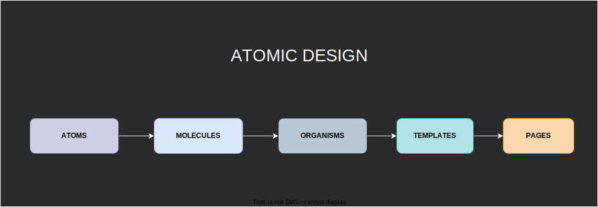
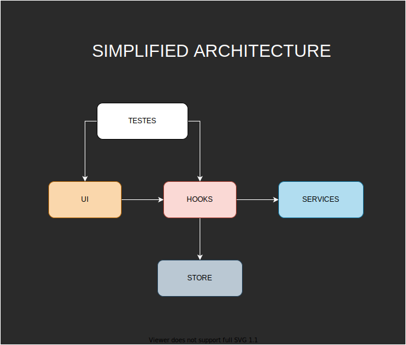
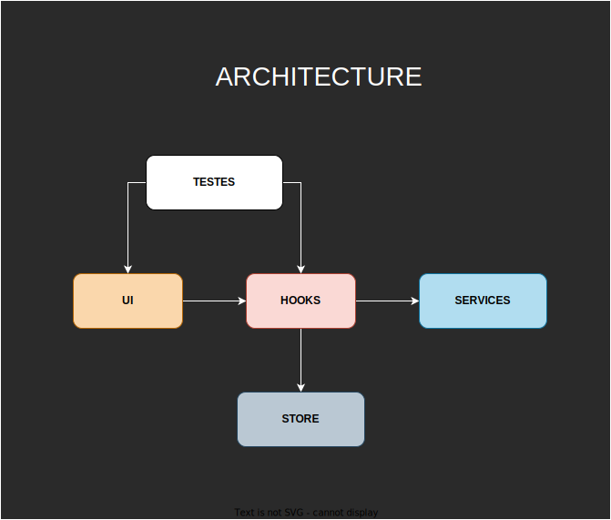

<div align="center">

  <a href="./LICENSE"></a>
  
  
</div>

<h1 align="center">Boilerplate Complete and updated with React.js, Webpack, Typescript, Styled-Components, Tests and Redux Toolkit</h1>

<br />

# :memo: About the Project

This application is a boilerplate for complex and large systems, especially those that need to scale with security and code quality.

In addition to being constantly updated, this project was configured in the smallest details to serve as a basis for professional projects that require standardized and easy-to-maintain code architecture and design.

<br />

<div align="center">
  
  
  <br />
  <br />
  
  
  
  <br />
  <br />
  
  
</div>

---

# :pushpin: Contents

* [Technologies](#globe_with_meridians-technologies)
* [Features](#triangular_flag_on_post-features)
* [Prerequisites](#white_check_mark-prerequisites)
* [How to install and run the project](#question-how-to-install-and-run-the-project)
  * [Clone Repository](#clone-repository)
  * [Install Dependencies](#install-dependencies)
  * [Start Development Environment](#start-development-environment)
  * [Generate Production Build](#generate-production-build)
  * [Generate Development Build](#generate-development-build)
  * [Start Production Environment](#start-production-environment)
  * [Run Tests](#run-tests)
  * [Run Tests in Watch Mode](#run-tests-in-watch-mode)
  * [Launch Storybook in Development Mode](#launch-storybook-in-development-mode)
  * [Generate Storybook Production Build](#generate-storybook-production-build)
  * [Run Lints](#run-lints)
* [Important Considerations](#rotating_light-important-considerations)
* [Author](#technologist-author)

<br />

---

# :globe_with_meridians: Technologies

⚛ React.js

🔥 TypeScript

💅 Styled-Components

🗂 Redux Toolkit and Redux-Persist

🚩 Lints: Husky, ESlint, Stylelint, Commitlint, Lint-Staged, Prettier, EditorConfig and Typecheck

✅ Jest 

🐙 React Testing Library

📝 Storybook

🔧 Webpack

<br />

---

# :triangular_flag_on_post: Features

- [x] Responsive design;

- [x] Atomic Design;

- [x] Accessible for mouseless navigation and screen readers;

- [x] Custom hooks for:
  - [x] animation in the assembly and disassembly of components;
  - [x] conditional rendering of components by breakpoints;
  - [x] dark/light theme change;
  - [x] set page title dynamically;

- [x] Theme created with styled-components without using a provider and no need to access theme properties with arrow functions;

- [x] Global state management Redux Toolkit and Slice pattern, all decoupled from the project UI;

- [x] Store data persistence in localStorage;

- [x] 100% coverage in tests including: components, templates, pages and hooks;

- [x] Theme Dark/Light without provider;

<br />

---

# :white_check_mark: Prerequisites

- node (latest version lts)

- yarn or npm

<br />

---

# :question: How to install and run the project

## Clone Repository

```bash
git clone https://github.com/everton-dgn/react_webpack_styled_components_redux_tlk_boilerplate.git
```

## Install Dependencies

```bash
yarn
```

## Start Development Environment

```bash
yarn dev
```

Available in http://localhost:3000

## Generate Production Build

```bash
yarn build
```

## Generate Development Build

```bash
yarn build:dev
```

## Start Production Environment

```bash
yarn start
```

Available in http://localhost:3001

## Run Tests

```bash
yarn test
```

## Run Tests in Watch Mode

```bash
yarn test:w
```

## Launch Storybook in Development Mode

```bash
yarn sb
```

Available in http://localhost:6006

## Generate Storybook Production Build

```bash
yarn build-sb
```

## Run Lints

```bash
yarn lint
```

```bash
yarn lint:css
```

```bash
yarn typecheck
```

<br />

---

# :rotating_light: Important Considerations

- The husky is configured to not allow commit if there are any lint and typescript errors. The push can only be done if all tests and builds (of the project and the storybook) pass.

- Due to husky's build check settings, to push with git, the development server must be stopped first or an error will occur in the `git push` command.

- Some conventions widely used in the React ecosystem were used. For example: 
  - In the root of the components folder, an export index was created to facilitate the use of components with named import. In this way, to use a component just import it as an object and use it with the prefix "C", thus avoiding several unnecessary lines of imports:
  
    ```jsx
    import * as C from 'components'
    
    ...
    <C.Card>
      <C.Input />
    </C.Card>
    ...
    ```

  - To import style sheets that use styled-components, named imports were used for the same reason as before, thus:

    ```jsx
    import * as S from './styles'
    
    ...
    <S.Wrapper>
      <S.Title />
    </S.Wrapper>
    ...
    ```

- To create a complete component folder with tests, storybook, index and styles files, just use the command in the terminal: `yarn generate ComponentName`

---

# :technologist: Author

By [Éverton Toffanetto](https://programadordesucesso.com).

:link: LinkedIn: https://www.linkedin.com/in/everton-toffanetto

:link: YouTube: https://www.youtube.com/c/ProgramadordeSucesso

:link: Site: https://programadordesucesso.com
